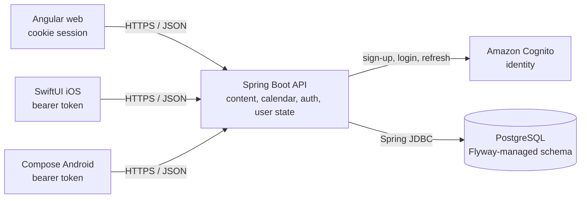

# Sanctuary Platform

Sanctuary is a Catholic prayer companion for daily liturgical life, saints, novenas, prayers, and account-backed spiritual progress. This repository is the production monorepo for the public web experience, the shared backend, and the native iOS and Android clients.

The central design decision is that **Spring Boot and PostgreSQL are the platform source of truth**. Angular, SwiftUI, and Jetpack Compose provide platform-specific experiences over the same content, calendar, authentication, profile, favorites, and novena-progress contracts.

- Production web: [mydailysanctuary.com](https://mydailysanctuary.com)
- Production API: [api.mydailysanctuary.com](https://api.mydailysanctuary.com)
- Dev web (access-controlled): [dev.mydailysanctuary.com](https://dev.mydailysanctuary.com)
- Dev API: [dev-api.mydailysanctuary.com](https://dev-api.mydailysanctuary.com)

## System At A Glance



The clients never connect to Cognito or PostgreSQL for product data directly. The API owns identity orchestration, JWT validation, Sanctuary user linkage, content queries, and liturgical calculations.

## Repository Layout

```text
sanctuary-platform/
├── apps/
│   ├── api/        # Java 21 / Spring Boot backend
│   ├── web/        # Angular browser client
│   ├── ios/        # SwiftUI native client
│   └── android/    # Kotlin / Jetpack Compose native client
├── docs/
│   ├── architecture/  # Design records, schemas, migration plans
│   ├── deployment/    # AWS, Cognito, RDS, App Store runbooks
│   └── security/      # Auth and session hardening audits
├── scripts/           # Database import, backup, and restore tools
├── assets/            # Shared source artwork and social assets
├── .github/workflows/ # Path-scoped validation and deployment pipelines
├── docker-compose.yml # Local PostgreSQL 17
├── package.json       # npm workspace root
└── README.md
```

`backups/`, build output, local environment files, IDE state, and dependency directories are intentionally ignored by Git.

## Platform Components

| Component | Implementation | Responsibility | Environment selection |
|---|---|---|---|
| API | Java 21, Spring Boot 3.5.6, Spring MVC, Spring Security, Spring JDBC, Flyway | Public content, liturgical calendar, Cognito auth, profiles, favorites, novena commitments | Spring profiles: `local`, `dev`, `uat`, `prod` |
| Web | Angular 21, TypeScript 5.9, RxJS, SCSS, Vitest | Responsive browser UI and share-preview routes | Host-based API/auth config; localhost can override with `?api=local|dev|prod` |
| iOS | Swift 5, SwiftUI, URLSession, Keychain | Native iPhone/iPad experience and local notifications | `Sanctuary-Dev`, `Sanctuary-UAT`, `Sanctuary-Prod` schemes |
| Android | Kotlin 2.0, Jetpack Compose, Retrofit/OkHttp, encrypted preferences | Native Android experience and alarm-backed notifications | `dev`, `uat`, `prod` Gradle product flavors |
| Data | PostgreSQL 17 locally and RDS PostgreSQL in AWS | Content, serving rules, linked users, preferences, favorites, commitments, activity | Flyway migrations `V1` through `V15` |
| Identity | Amazon Cognito | Registration, confirmation, login, token refresh, password reset | Separate configured pools/clients for dev and production |

All three client applications are currently `1.0.13`. The API artifact remains `0.0.1-SNAPSHOT` because its deploy identity is the Git commit/image tag rather than a client release version.

## Product And Domain Coverage

The shared platform currently implements:

- liturgical day and bounded date-range calculation, including Gregorian computus, seasons, anchor dates, ranks, and transferred feasts;
- saints by feast day or date range, text search, detail/source data, patronage terms, and intention associations;
- prayers and rosaries with category-aware filtering and detail content;
- novena search, calendar serving windows, intention terms, detail content, daily prayers, and commitment progress;
- English, Spanish, and Polish content selection (`en`, `es`, `pl`);
- account registration, email confirmation, login, refresh, logout, password recovery, and account deletion;
- profile/preferences, favorites, reminder preferences, and novena commitments;
- client-side daily/novena reminder scheduling on iOS and Android;
- responsive web, native mobile UI, environment/version display, legal/support content, and deep/share link assets.

The API database is authoritative for served platform content. Legacy/source JSON remains bundled under the iOS resources for migration provenance and product reference; it is not the runtime source for API-backed screens.

## How Requests And State Flow

### Public content

1. A client selects its environment-specific API base URL.
2. It calls `/calendar/**` or `/content/**` without authentication.
3. Controllers and services validate dates, ranges, and languages, then normalize search input.
4. Services calculate calendar results or query PostgreSQL repositories.
5. DTOs provide a common JSON contract to all three clients.

### Accounts and authenticated state

1. Clients submit auth operations to `/auth/**`; the API performs Cognito calls server-side.
2. Web login/reset endpoints issue scoped, `HttpOnly` session cookies. Angular sends credentials with API requests and retries one refresh on a `401`; tokens are not retained in JavaScript-accessible Web Storage.
3. iOS and Android receive tokens from the native endpoints, keep sessions in Keychain/encrypted shared preferences, attach a bearer token to `/me/**`, and refresh after expiry or rejection.
4. Spring Security validates the Cognito issuer and configured audience/client ID.
5. The Cognito subject is linked to Sanctuary's `users` record. Product state is then read from or written to PostgreSQL.

When auth is enabled, `/health`, `/actuator/**`, `/auth/**`, `/calendar/**`, and `/content/**` are public; `/me/**` requires a valid cookie or bearer token; unrecognized routes are denied.

## API Surface

Dates use ISO `YYYY-MM-DD`. Content endpoints default to `lang=en`; supported values are `en`, `es`, and `pl`. The calendar range endpoint accepts at most 62 inclusive days, and calculated years are limited to 1900–4099.

### Health and calendar

| Method | Route | Purpose |
|---|---|---|
| `GET` | `/health` | Lightweight application health response |
| `GET` | `/actuator/health` | Spring Actuator health |
| `GET` | `/calendar/day/{date}` | One calculated liturgical day |
| `GET` | `/calendar/range?start=&end=` | Inclusive liturgical range, up to 62 days |
| `GET` | `/calendar/anchors/{year}` | Calculated liturgical anchors |
| `GET` | `/calendar/novenas/{novenaId}/window/{year}` | A novena's calculated serving window |

### Content

| Method | Route | Purpose |
|---|---|---|
| `GET` | `/content/saints?month=&day=&lang=` | Saints on a recurring feast day |
| `GET` | `/content/saints/range?start=&end=&lang=` | Saints grouped over a date range |
| `GET` | `/content/saints/search?query=&lang=` | Search/list saints |
| `GET` | `/content/saints/{slug}?lang=` | Saint detail and sources |
| `GET` | `/content/prayers?query=&lang=&category=&excludeCategory=` | Search/filter prayers and rosaries |
| `GET` | `/content/prayers/{slug}?lang=` | Prayer detail |
| `GET` | `/content/novenas?query=&lang=` | Search/list novenas |
| `GET` | `/content/novenas/intentions?query=&lang=` | Legacy direct intention search |
| `GET` | `/content/novenas/calendar?start=&end=&lang=` | Novenas grouped by serving date |
| `GET` | `/content/novenas/{slug}?lang=` | Novena detail and days |
| `GET` | `/content/intentions/search?query=&lang=` | Legacy intention search response; currently returns matching novenas and an empty saints list |
| `GET` | `/content/intentions/terms?query=&lang=` | Canonical intention terms |
| `GET` | `/content/intentions/terms/{key}/novenas?lang=` | Novenas linked to an intention |
| `GET` | `/content/patronages/terms?query=&lang=` | Canonical patronage terms |
| `GET` | `/content/patronages/terms/{key}/saints?lang=` | Saints linked to a patronage |

### Authentication

Native clients use the token-returning endpoints. The browser variants return public session metadata and set or clear cookies.

| Method | Route | Purpose |
|---|---|---|
| `POST` | `/auth/register` | Register an account |
| `POST` | `/auth/confirm` | Confirm the emailed registration code |
| `POST` | `/auth/resend-confirmation` | Resend a registration code |
| `POST` | `/auth/login` | Native login with token response |
| `POST` | `/auth/refresh` | Native token refresh |
| `POST` | `/auth/forgot-password` | Start password recovery |
| `POST` | `/auth/reset-password` | Native password reset with token response |
| `POST` | `/auth/web/login` | Browser login and cookie creation |
| `POST` | `/auth/web/refresh` | Browser refresh-cookie exchange |
| `POST` | `/auth/web/logout` | Clear browser session cookies |
| `POST` | `/auth/web/reset-password` | Browser password reset and cookie creation |

Configurable in-memory abuse limits cover registration, native login, forgot-password, and confirmation-code resend. Configured email domains are blocked during registration.

### Current user

Every route below requires authentication.

| Method | Route | Purpose |
|---|---|---|
| `GET` | `/me` | Profile, preferences, and aggregate counts |
| `DELETE` | `/me` | Revoke/delete the Cognito identity, delete relational user data, and retain a hashed deletion marker |
| `PUT` | `/me/preferences` | Update language, time zone, onboarding, communications, and reminder flags |
| `GET` | `/me/favorites` | List favorites |
| `PUT` / `DELETE` | `/me/favorites/{itemType}/{itemId}` | Add or remove a saint, novena, or prayer favorite |
| `GET` | `/me/novena-commitments` | List commitments and progress |
| `PUT` / `DELETE` | `/me/novena-commitments/{novenaId}` | Save or remove a commitment |

There is not currently a generated OpenAPI specification. The controller classes under `apps/api/src/main/java/app/sanctuary/api/**/web` and the DTOs beside each domain are the executable contract.

## Local Development

### Prerequisites

- Git
- Node.js 22 and npm (CI uses Node 22; the web workspace declares npm `10.8.2`)
- Java 21 and Maven (`mvn` must be on `PATH`)
- Docker with Compose
- Xcode for iOS work
- Android Studio or an Android SDK with API 35 for Android work

### 1. Install web dependencies

From the repository root:

```bash
npm ci
```

### 2. Configure the local database

The root `.env` is deliberately untracked. Create it with matching Docker and JDBC credentials:

```dotenv
POSTGRES_DB=sanctuary
POSTGRES_USER=sanctuary
POSTGRES_PASSWORD=change-me-now

SANCTUARY_DB_URL=jdbc:postgresql://localhost:5432/sanctuary
SANCTUARY_DB_USERNAME=sanctuary
SANCTUARY_DB_PASSWORD=change-me-now
SANCTUARY_API_PORT=8080
```

Use a machine-local password; do not commit `.env`. Optional Cognito and cookie overrides are documented in [`apps/api/README.md`](apps/api/README.md) and the profile files under `apps/api/src/main/resources`.

### 3. Start PostgreSQL and the API

```bash
docker compose up -d postgres
./apps/api/scripts/run-local.sh
```

The helper verifies Java 21, loads the root `.env`, and starts Spring Boot with the `local` profile. Flyway creates or upgrades the schema during startup.

Migrations define the schema but do not provide a complete development content catalog. Restore a team-provided local dump when one is available, or use the explicit import tooling; content import is intentionally not an application-startup side effect.

### 4. Start the web client

In a second terminal:

```bash
npm start --workspace web
```

| Service | Local URL |
|---|---|
| Web | `http://localhost:4200` |
| API | `http://localhost:8080` |
| Health | `http://localhost:8080/health` |
| PostgreSQL | `localhost:5432` |

The web app automatically selects the local API on `localhost` and uses the local cookie-compatible auth configuration.

### Native clients against a local API

For iOS, set the `SANCTUARY_API_BASE_URL` environment variable in the active Xcode scheme to `http://localhost:8080` for a simulator run.

For Android Dev debug, place this untracked value in `apps/android/local.properties` (use `10.0.2.2` for the standard emulator's host loopback):

```properties
SANCTUARY_ANDROID_DEV_API_BASE_URL=http://10.0.2.2:8080
```

Only the `devDebug` Android variant accepts the override and enables cleartext traffic when the URL begins with `http://`. UAT and production remain pinned to HTTPS.

## Build And Test Commands

Run these from the repository root unless the command changes directory.

| Area | Validation | Production/release build |
|---|---|---|
| API | `cd apps/api && mvn -q test` | `docker build -f apps/api/Dockerfile apps/api` |
| Web | `npm test --workspace web -- --watch=false` | `npm run build --workspace web` |
| Android | `cd apps/android && ./gradlew assembleDevDebug` | `./gradlew bundleProdRelease` |
| iOS Prod | configuration verifier plus simulator build below | Archive/signing is handled by CI |

The API suite includes unit tests for calendar, auth, validation, CORS, and user services/repositories. Its novena rule audit runs against `SANCTUARY_TEST_DATABASE_URL` when a populated database is reachable and otherwise skips by assumption. The repository currently has no committed iOS or Android unit-test targets, so CI validates those clients by compiling representative variants.

Validate iOS configuration and the production simulator build:

```bash
swiftc \
  apps/ios/Sanctuary/Core/Application/PlatformConfiguration.swift \
  apps/ios/Scripts/verify-platform-configuration.swift \
  -o /tmp/verify-sanctuary-platform
/tmp/verify-sanctuary-platform

xcodebuild \
  -project apps/ios/Sanctuary.xcodeproj \
  -scheme Sanctuary-Prod \
  -configuration Debug \
  -destination 'generic/platform=iOS Simulator' \
  CODE_SIGNING_ALLOWED=NO \
  build
```

Dev and UAT simulator validation use `Sanctuary-Dev` / `Debug-Dev` and `Sanctuary-UAT` / `Debug-UAT` respectively.

## Application Notes

### Web (`apps/web`)

- A standalone Angular application with a facade-driven shell; `app.routes.ts` is intentionally empty and page/modal navigation is held by `AppShellFacade` rather than Angular route components.
- Runtime host mapping selects local, dev, or production API URLs. `?api=local`, `?api=dev`, and `?api=prod` are supported diagnostic overrides.
- `auth-config.js` enables the appropriate Cognito client, while auth calls still flow through the Sanctuary API.
- The cookie interceptor sets `withCredentials`, refreshes once after a `401`, and avoids persistent browser token storage.
- The production build also runs `scripts/generate-share-previews.mjs` to fetch content and create crawlable saint, novena, and prayer preview paths. It uses the production API/site by default and supports explicit API, site-origin, and output-directory environment overrides.

### API (`apps/api`)

- Packages are organized by `auth`, `calendar`, `content`, `health`, and `user`, with cross-cutting HTTP/security configuration under `config`.
- Persistence uses explicit Spring JDBC repositories rather than JPA/Hibernate.
- Flyway migrations are forward-only SQL under `src/main/resources/db/migration`.
- The multi-stage Dockerfile builds with Maven/Temurin 21 and runs on a Temurin 21 JRE.
- Production ECS injects database and Cognito settings; the RDS-managed Secrets Manager secret is the source for the database password.

### iOS (`apps/ios`)

- SwiftUI features are separated from `Core/Application`, `Core/Data`, and `Core/Domain` abstractions.
- `SanctuaryAPIClient` and API-backed repositories serve content and authenticated user state; a local progress repository remains for previews/legacy support, not the production environment.
- Sessions are persisted in Keychain and authenticated requests use bearer tokens with refresh-on-rejection behavior.
- Bundle IDs select dev (`.dev`), UAT (`.uat`), or production; Dev uses the dev API, while UAT and Prod currently use the production API.
- Universal Links open saint, novena, and prayer detail flows. A Core Location/MapKit parish-finder source file exists but is not currently wired into app navigation.
- Deployment target is iOS 16.6. CI validates on macOS and uploads signed builds through App Store Connect.

### Android (`apps/android`)

- A single Compose app module currently concentrates much of the UI in `MainActivity.kt`, with state orchestration in `MainViewModel` and network/session code under `data`.
- Retrofit models mirror API DTOs; OkHttp attaches bearer auth and performs basic request logging.
- Sessions and language selection use `EncryptedSharedPreferences`; reminder scheduling uses a separate private `SharedPreferences` file.
- Navigation Compose and DataStore are installed dependencies, but the current shell uses `rememberSaveable` tab/modal state and does not use either runtime API.
- Verified App Links open saint, novena, and prayer detail flows on `mydailysanctuary.com` and `www.mydailysanctuary.com`.
- Flavors use application IDs `com.pamisu.sanctuary.dev`, `.uat`, and `com.pamisu.sanctuary` for production.
- `minSdk` is 26, `targetSdk`/`compileSdk` are 35, and Kotlin bytecode targets Java 17. CI itself runs Gradle on Java 21.

## Data And Operations

Flyway currently covers platform metadata; saints, sources, tags, and patronages; prayers and tags; novenas, days, intentions, and serving rules; users and preferences; favorites and commitments; activity events; deletion records; and normalized global intention/patronage links.

Useful local operations:

```bash
# Create timestamped custom and SQL dumps under ignored backups/
bash scripts/export_db.sh

# Replace the local public schema with backups/sanctuary_latest.dump
bash scripts/restore_db.sh

# Restore a selected dump or SQL file
bash scripts/restore_db.sh backups/sanctuary-YYYYMMDD-HHMMSS.dump

# Explicit novena import (requires Python and psql)
python3 scripts/import_novenas.py
```

`restore_db.sh` drops and recreates the local `public` schema before loading the backup. Treat it as destructive to the current local database.

## Environments, CI, And Delivery

The repository uses the promotion path `feature -> dev -> uat -> prod -> main`. `main` is the production deployment/release trigger; `prod` is a pre-main promotion branch, not the deployed production branch.

Workflows are path-scoped so a mobile-only change does not redeploy the API or web application.

| Workflow | Pull-request validation | Push/deploy behavior |
|---|---|---|
| [`api-dev-deploy.yml`](.github/workflows/api-dev-deploy.yml) | API tests for PRs to `dev` | `dev` builds/pushes ECR and updates the dev ECS service |
| [`api-prod-deploy.yml`](.github/workflows/api-prod-deploy.yml) | API tests for PRs to `dev`, `uat`, `prod`, or `main` | `main` tests, smoke-tests the image, pushes ECR, updates ECS, and checks public health |
| [`web-dev-deploy.yml`](.github/workflows/web-dev-deploy.yml) | Web build for PRs to `dev` | `dev` syncs to the dev S3 bucket and invalidates dev CloudFront |
| [`web-prod-deploy.yml`](.github/workflows/web-prod-deploy.yml) | Web build for PRs to `dev`, `uat`, `prod`, or `main` | `main` syncs to production S3 and invalidates CloudFront |
| [`ios-pipeline.yml`](.github/workflows/ios-pipeline.yml) | Environment-matched simulator build | `dev` and `uat` upload TestFlight builds; `main` uploads production to App Store Connect |
| [`android-pipeline.yml`](.github/workflows/android-pipeline.yml) | `assembleDevDebug` for Android-scoped PRs | `dev` uploads internal draft, `uat` and `main` upload alpha/closed-testing draft bundles |

Native store submission is automated only through artifact upload. Final tester rollout and public store release remain controlled in App Store Connect and Google Play Console.

## Documentation Map

Start with the component README for focused work, then use the operational documents for deeper context:

- [`apps/api/README.md`](apps/api/README.md) — backend profiles, routes, database, deployment
- [`apps/web/README.md`](apps/web/README.md) — Angular structure, auth, build, deployment
- [`apps/ios/README.md`](apps/ios/README.md) — schemes, API integration, local builds, release
- [`apps/android/README.md`](apps/android/README.md) — flavors, signing, builds, Play pipeline
- [`docs/architecture/local-development.md`](docs/architecture/local-development.md) — local infrastructure decisions
- [`docs/architecture/postgres-schema.md`](docs/architecture/postgres-schema.md) — relational model and ownership
- [`docs/architecture/liturgical-engine-plan.md`](docs/architecture/liturgical-engine-plan.md) — calendar model and rules
- [`docs/architecture/deployment-and-pipelines.md`](docs/architecture/deployment-and-pipelines.md) — environment and pipeline design
- [`docs/security/session-storage-audit-and-cookie-migration-plan.md`](docs/security/session-storage-audit-and-cookie-migration-plan.md) — browser/native session model
- [`docs/deployment/cognito-auth-setup.md`](docs/deployment/cognito-auth-setup.md) — Cognito configuration
- [`docs/deployment/api-prod-deploy-setup.md`](docs/deployment/api-prod-deploy-setup.md) — ECS production setup
- [`docs/deployment/rds-production-bootstrap.md`](docs/deployment/rds-production-bootstrap.md) — database bootstrap and secrets
- [`docs/android-play-console-setup.md`](docs/android-play-console-setup.md) — Play Console setup
- [`docs/deployment/ios-app-store-verification-checklist.md`](docs/deployment/ios-app-store-verification-checklist.md) — App Store verification

Historical plans and audit notes under `docs/architecture`, `docs/deployment`, and `docs/security` explain how the current platform was reached. For current runtime truth, prefer manifests, Spring profile files, controllers, client API services, and `.github/workflows` over dated planning language.
